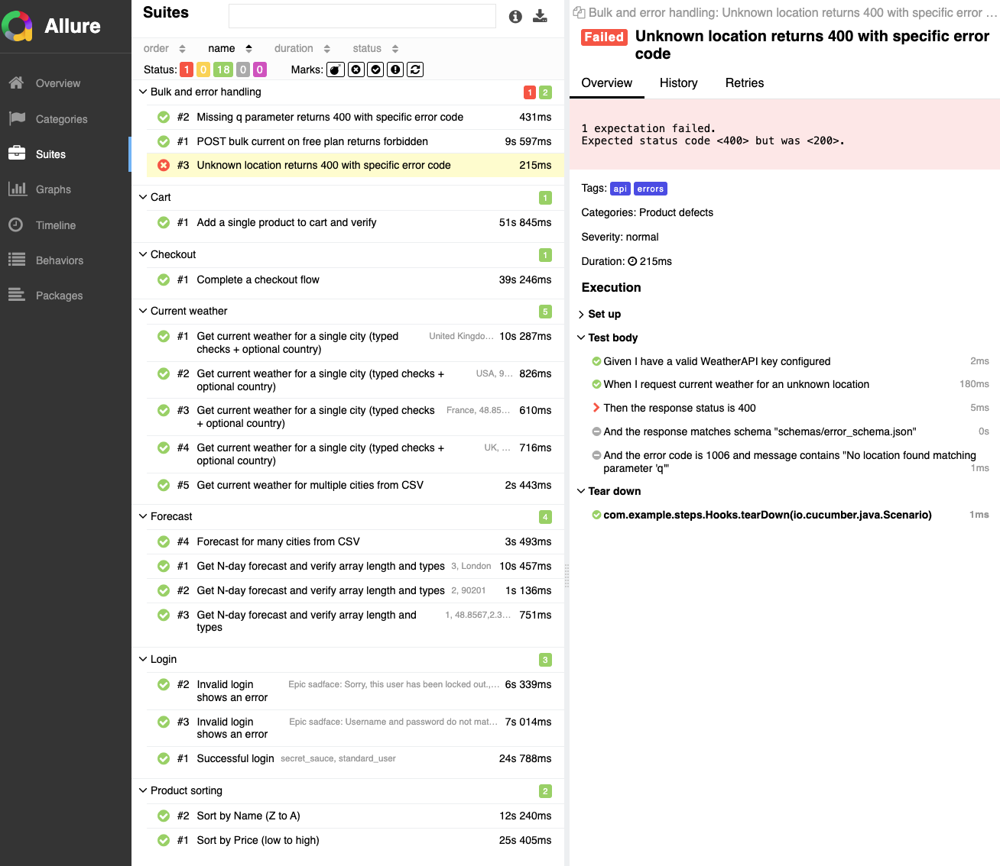
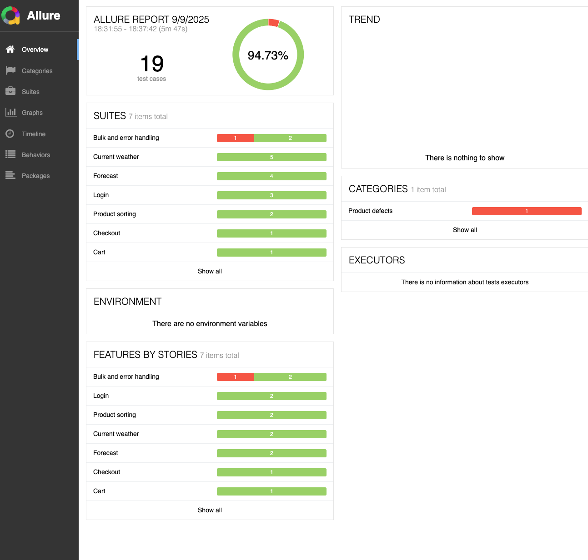
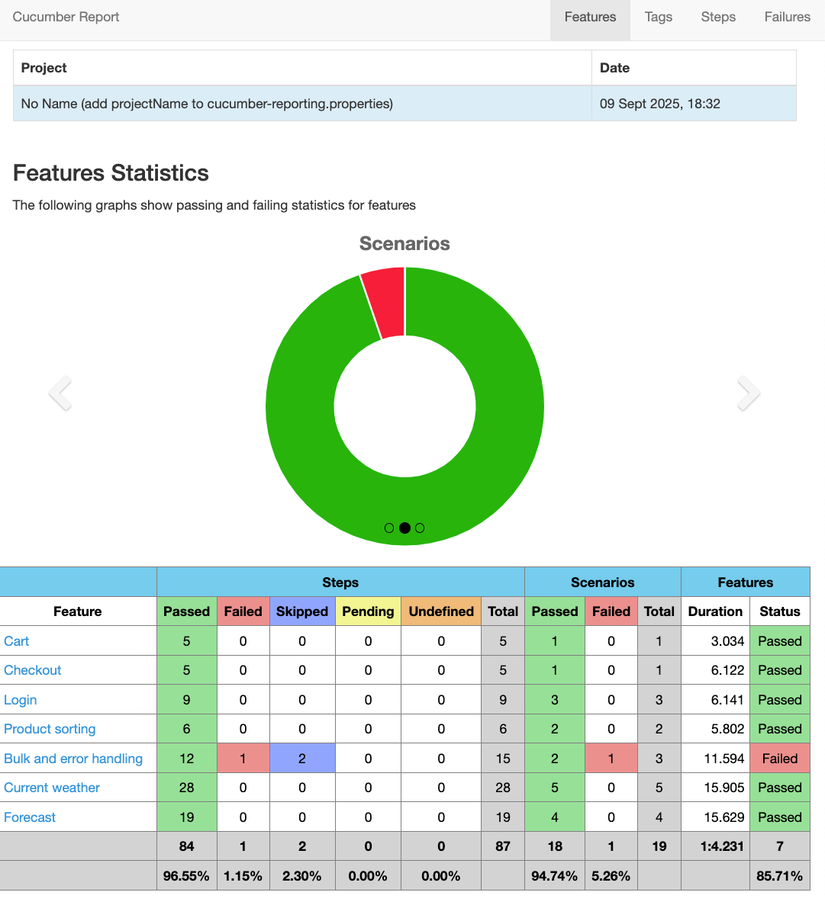

# Java • JUnit • Cucumber • Selenium • Rest Assured • aXe • JWT OAuth Owasp  • Gatling

- Quick Links: [README.md](README.md) (quick start) • [HOW_TO_RUN_PERFORMANCE_TESTS.md](HOW_TO_RUN_PERFORMANCE_TESTS.md) (performance guide)

This repository provides a unified automation framework for UI, API, accessibility, security baseline, and performance testing using Java 21, Maven, Selenium, Cucumber, Rest Assured, axe-core/selenium, and Gatling.

## Prerequisites

- JDK 21
  - Ensure JAVA_HOME points to your JDK 21 install
- Maven 3.9+
- IntelliJ IDEA (recommended)
- Optional: Allure CLI for local report viewing

## Highlights

- Cucumber BDD with page objects and reusable step libs
- UI automation with Selenium WebDriver (Chrome, Firefox, Safari, Edge)
- API testing with Rest Assured (data-driven from CSV/JSON)
- Accessibility checks with axe-core/selenium (@accessibility)
- Security baseline checks for headers on web and API endpoints (@security)
- Parallel execution via Surefire
- Reporting: Cucumber JSON/HTML, PrettyReports, Allure
- Performance testing with Gatling (Weather API, etc.)

## Project Structure

- `pom.xml` — build, dependencies, plugins (Surefire, Allure, Gatling)
- `src/test/java` — runners, step defs, hooks, page objects, utils
- `src/test/resources` — feature files, test data, schemas
- `configuration.properties` — default config (copy from `configuration.properties.template`)
- `target/` — build outputs and reports
  - `target/cucumber-report.html` — Cucumber HTML
  - `target/cucumber.json` — Cucumber JSON
  - `target/allure-results/` — Allure raw results
- `scripts` — helper scripts at repo root:
  - `quick-perf-test.sh`, `run-performance-tests.sh`, `verify-performance-setup.sh`

## Setup

1) Clone and open the project
   ```bash
   git clone <your-repo-url>
   cd <your-repo-directory>
   ```
2) Create your local config
   ```bash
   cp configuration.properties.template configuration.properties
   ```
3) (Optional) Install Allure CLI if you want local Allure HTML reports

## Configuration

- Browser: set in `configuration.properties` or via system property
  - `browser=chrome` (default). Supported: `chrome`, `chrome-headless`, `firefox`, `firefox-headless`, `safari` (macOS), `edge` (Windows)
  - Headless toggle: `-Dheadless=true` (defaults to headless on CI, headed locally)
- SauceDemo URL and default credentials exist in the template file
- Weather API base URL is configured; the API key must be provided via environment
  - `export WEATHER_API_KEY=your_api_key`

## How to Run

- Run all standard tests (excluding @accessibility and @security by default via runner tags)
  ```bash
  mvn clean test
  ```
- Specify browser/headless
  ```bash
  mvn clean test -Dbrowser=chrome-headless
  mvn clean test -Dbrowser=firefox -Dheadless=true
  ```
- Filter by tags (Cucumber v6 system property)
  ```bash
  mvn clean test -Dcucumber.filter.tags="@smoke"
  mvn clean test -Dcucumber.filter.tags="not @accessibility and not @security"
  ```
- Run a specific feature or scenario
  ```bash
  mvn clean test -Dcucumber.features=src/test/resources/features/ui/ui_login.feature
  mvn clean test -Dcucumber.filter.tags="@ui and @login"
  ```

### Runners

- UI/API default: `com.example.runners.CukesRunner`
- Accessibility only: `com.example.runners.AccessibilityRunner` (tags: `@accessibility`)
- Security suite: `com.example.runners.SecurityRunner` (tags: `@security`)
- Performance (JUnit suite): `com.example.runners.PerformanceRunner`
- Performance (Cucumber): `com.example.runners.PerformanceCukesRunner` (default tags: `@performance and @smoke`)

You can run them from the IDE or with Surefire includes already configured in `pom.xml`.

### Security Test Suite

Covers both web (SauceDemo) and API (Weather API) security headers.

- Useful tags
  - `@security` — all security scenarios
  - `@web` — web-only
  - `@api` — API-only (requires `WEATHER_API_KEY`)
  - `@requires_key` — scenarios needing a valid key
  - `@rate_limit` — rate-limiting tests (usually excluded in CI)
  - `@no_hsts` — relaxed API baseline (skip HSTS for JSON endpoints)
- Examples
  ```bash
  # All security tests
  mvn clean test -Dcucumber.filter.tags='@security'
  
  # Web-only
  mvn clean test -Dcucumber.filter.tags='@security and @web'
  
  # API-only (set key first)
  export WEATHER_API_KEY=your_api_key
  mvn clean test -Dcucumber.filter.tags='@security and @api'
  
  # Exclude rate limit
  mvn clean test -Dcucumber.filter.tags='@security and not @rate_limit'
  
  # Relaxed API baseline without HSTS
  mvn clean test -Dcucumber.filter.tags='@security and @api and @no_hsts'
  ```

### Accessibility

- Tag features/scenarios with `@accessibility` and run via `AccessibilityRunner` or tags:
  ```bash
  mvn clean test -Dcucumber.filter.tags='@accessibility'
  ```

## Performance Testing

### Gatling

Read the step-by-step guide in `HOW_TO_RUN_PERFORMANCE_TESTS.md`. Quick start:

```bash
# Set the Weather API key
export WEATHER_API_KEY=your_api_key

# Quick local run
./quick-perf-test.sh

# Or run directly with Maven
mvn gatling:test \
  -Dgatling.simulationClass=com.example.performance.simulations.WeatherApiPerformanceSimulation \
  -Dperf.users=5 -Dperf.duration=30
```

### PerformanceRunner (JUnit)

A JUnit suite to run REST Assured-based performance tests (e.g., `WeatherApiPerformanceTest`).

```bash
# Prerequisite
export WEATHER_API_KEY=your_api_key

# Run the JUnit performance suite
mvn -Dtest=PerformanceRunner test

# Optional overrides
mvn -Dtest=PerformanceRunner test \
  -Dperf.users=10 -Dperf.rampup=10 -Dperf.duration=60
```

### Performance (Cucumber)

A Cucumber runner is available for quick perf smoke checks using `@performance` feature(s). By default it runs scenarios also tagged `@smoke` to keep runs fast.

```bash
# Prerequisite for Weather examples
export WEATHER_API_KEY=your_api_key

# Default fast run: executes @performance AND @smoke
mvn -Dtest=PerformanceCukesRunner test

# Run all @performance scenarios (including non-@smoke)
mvn -Dtest=PerformanceCukesRunner -Dcucumber.filter.tags='@performance' test

# Tune loads quickly using -Dperf.*
mvn -Dtest=PerformanceCukesRunner test \
  -Dperf.threads=5 \
  -Dperf.requests=50 \
  -Dperf.maxUsers=20 \
  -Dperf.rampupSeconds=5 \
  -Dperf.requestsPerUser=3
```

The starter feature lives at `src/test/resources/features/performance/perf_smoke.feature`. The lighter “simple load” scenario is tagged `@smoke` by default.

## Reports

- Cucumber HTML: `target/cucumber-report.html`
- Cucumber JSON: `target/cucumber.json`
- Allure results: `target/allure-results/`
  - View locally with Allure CLI:
    ```bash
    allure serve target/allure-results
    ```
- PrettyReports are also generated via plugin configuration







## Notes

- Do not commit secrets. Provide the Weather API key via environment variables.
- Browser drivers are managed by your local browser/driver setup. Safari is macOS-only; Edge requires Windows.
- If you see CI-related flags in logs, they are set to make Chrome stable in containerized runners.
